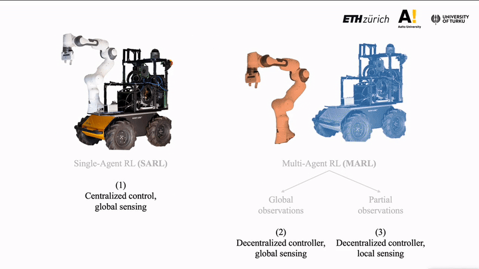
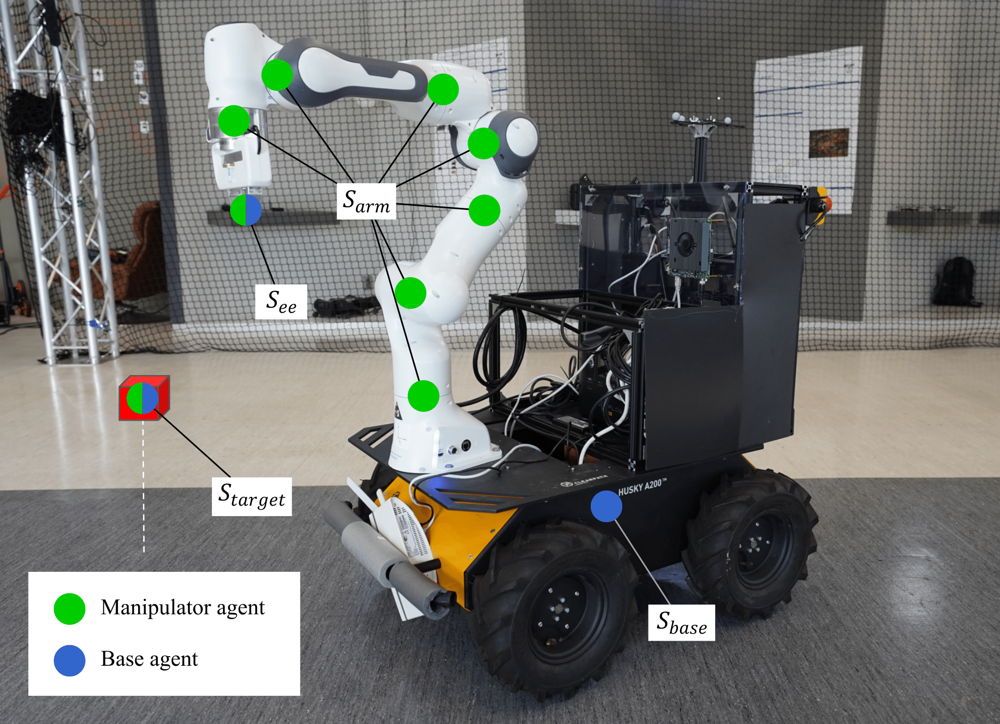
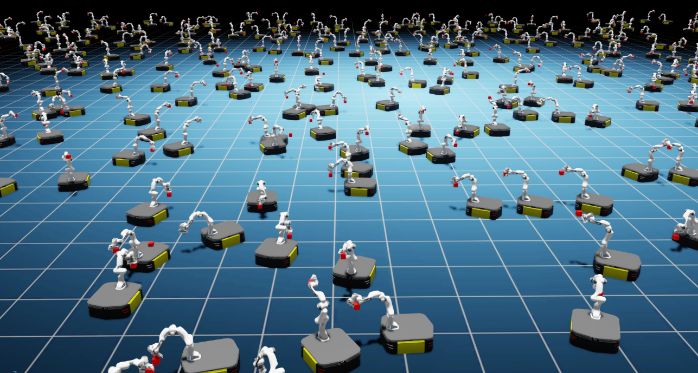

# Multi-Agent Reinforcement Learning for Mobile Manipulation with Isaac Sim

Partially and Globally Observable Multi-Agent Reinforcement Learning for Mobile Manipulation with NVIDIA Isaac Sim

## Introduction

In this repo, we explore multi-agent RL for distributing the control policies of a mobile manipuator. We study whether separating the base and manipulator control policies yields a different performance or robustness.





## Installation

(Modified from https://github.com/NVIDIA-Omniverse/OmniIsaacGymEnvs/tree/release/2022.2.0)

Follow the Isaac Sim [documentation](https://docs.omniverse.nvidia.com/app_isaacsim/app_isaacsim/install_basic.html) to install the latest Isaac Sim release. (Only tested with Isaac Sim version 2022.2.0.)

Once installed, this repository can be used as a python module, `omniisaacgymenvs`, with the python executable provided in Isaac Sim.

To install `omniisaacgymenvs`, first clone this repository:

```bash
git clone https://github.com/TIERS/isaac-marl-mobile-manipulation
```

Once cloned, locate the [python executable in Isaac Sim](https://docs.omniverse.nvidia.com/app_isaacsim/app_isaacsim/install_python.html). By default, this should be `python.sh`. We will refer to this path as `PYTHON_PATH`.

To set a `PYTHON_PATH` variable in the terminal that links to the python executable, we can run a command that resembles the following. Make sure to update the paths to your local path.

```
For Linux: alias PYTHON_PATH=~/.local/share/ov/pkg/isaac_sim-*/python.sh
For Windows: doskey PYTHON_PATH=C:\Users\user\AppData\Local\ov\pkg\isaac_sim-*\python.bat $*
For IsaacSim Docker: alias PYTHON_PATH=/isaac-sim/python.sh
```

Install `omniisaacgymenvs` as a python module for `PYTHON_PATH`. Change directory to root of this repo and run:

```bash
PYTHON_PATH -m pip install -e .
```

## Training

Training can be run with the following commands from inside the omniisaacgymenvs folder:

For single-agent PPO
```bash
PYTHON_PATH scripts/rlgames_train.py task=MobileFranka
```

For MARL with full observations
```bash
PYTHON_PATH scripts/rlgames_train.py task=MobileFrankaMARL
```

For MARL with partial observations
```bash
PYTHON_PATH scripts/rlgames_train.py task=MobileFrankaMARL_cv
```

You can vary the parallel environments number by num_envs argument:
```bash
PYTHON_PATH scripts/rlgames_train.py task=MobileFranka num_envs=512
```
Note that
* rl-games requires `minibatch_size` defined in the training config to be a factor of `horizon_length * num_envs`. If this is not the case, you may see an assertion error `assert(self.batch_size % self.minibatch_size == 0)`. Please adjust the parameters in the training config `yaml` file accordingly.
* Good starting point for figuring out the minibatch size is usually (horizon_length * num_envs) / 2

For more information, please check out the [documentation for OmniIsaacGymEnvs](https://github.com/NVIDIA-Omniverse/OmniIsaacGymEnvs/tree/release/2022.2.0).



## Exporting the neural network

Neural networks can be exported to ONNX format for deployment on a real robot. After running the following scripts the .onnx file will appear in the folder where you executed the script.

For single-agent PPO
```bash
PYTHON_PATH scripts/rlgames_onnx_normalized.py task=MobileFranka test=True checkpoint=CHECKPOINT_PATH
```

For multi-agent
```bash
PYTHON_PATH scripts/rlgames_onnx_normalized_marl.py task=MobileFrankaMARL test=True checkpoint=CHECKPOINT_PATH
```
(change MobileFrankaMARL to MobileFrankaMARL_cv for partial MARL)


## Citation

If you use this dataset for any academic work, please cite the following publication:

```
@misc{wenshuai2023less,
    title={Less Is More: Robust Robot Learning via Partially Observable Multi-Agent Reinforcement Learning}, 
    author={Wenshuai Zhao and Eetu Rantala and Joni Pajarinen and Jorge Peña Queralta},
    year={2023},
    eprint={},
    archivePrefix={arXiv},
    primaryClass={cs.RO}
}
```
